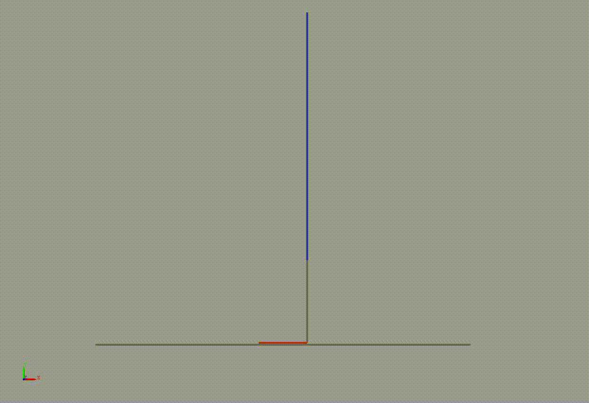

# Biophysics Simulation of a One-Legged Skier

This project simulates a one-legged skier using a biomechanical model controlled by a Reinforcement Learning agent. The goal is to investigate how balance can be achieved and maintained through leg and upper-body movements alone.

---

### See the Skier Balance:

Watch our Reinforcement Learning agent learn to balance the one-legged skier model.

*   **Fixed Board Simulation:** The skier balances on a stationary ski.
    

*   **Moving Board Simulation:** The skier maintains balance even when the ski itself is moving.
    

---

## Project Overview

This work combines biomechanical modeling with data-integrated simulation and reinforcement learning to explore dynamic balancing.

### Key Components:

1.  **Biomechanical Model:**
    *   A multi-segment model representing the upper body, leg (upper/lower), foot, and ski.
    *   Features Hip, Knee, and Ankle joints for dynamic movement.

2.  **Muscle Model (Theory):**
    *   **Hill-Type Muscle Models** are used to simulate muscle actuation at each joint. These models capture active force generation (CE) and passive elastic properties (PEE, SEE, SDE), enabling realistic motion.

3.  **Reinforcement Learning (RL) Control:**
    *   **RL Agent:** Learns to control the skier by interacting with the simulation environment.
    *   **Algorithm:** **Deep Deterministic Policy Gradient (DDPG)** for continuous control.
    *   **Observations (Input):** Skier's height, joint angles, angular velocities, and angular accelerations.
    *   **Actions (Output):** Muscle activations for Hip, Knee, and Ankle joints.
    *   **Reward Function:** Incentivizes maintaining height and duration, while penalizing excessive muscle activity and joint speeds:
        `r = (h²) + (1) - (0.1 * u²) - (0.075 * (w_ankle² + w_knee² + w_hip²))`
    *   **Stopping Criteria:** Simulation ends on max time, joint limit breach, or falling.

### Conclusion:

The simulations successfully demonstrate that balancing a one-legged skier model using only leg movements is achievable through learned control policies.

---

## Further Details:

For a comprehensive look at the model, theory, and control strategies, please refer to the [project slides](slides.pdf).
